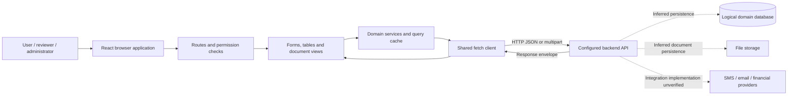
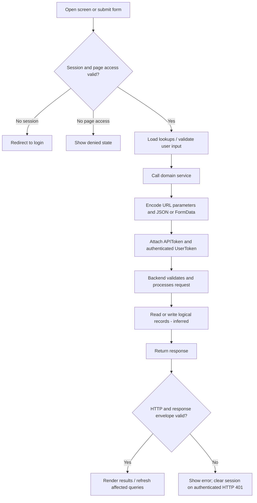
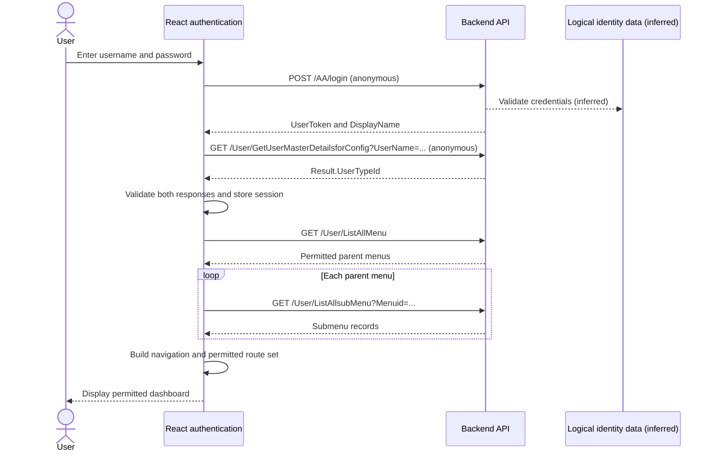
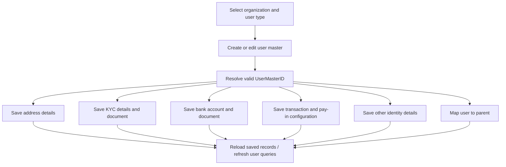
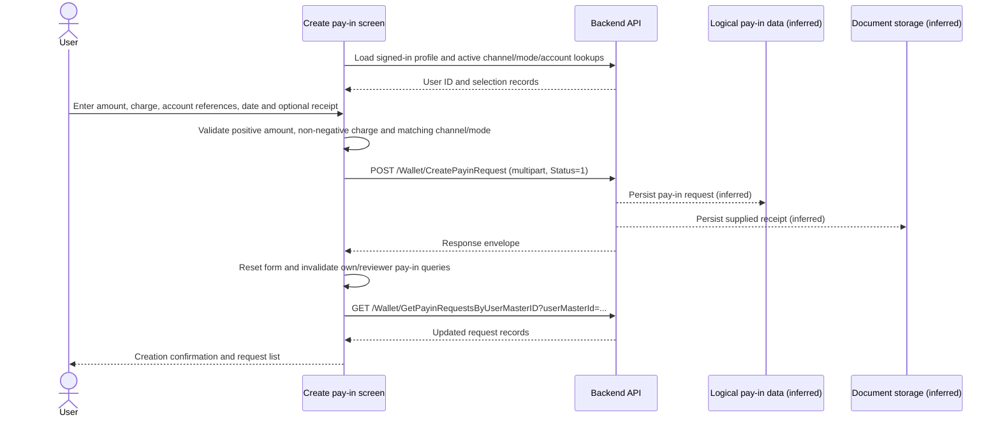
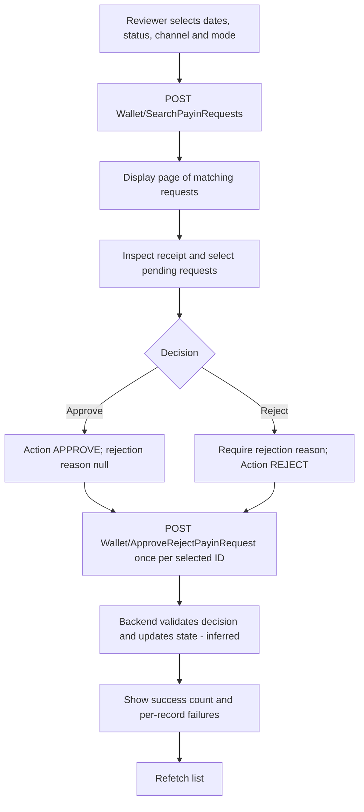
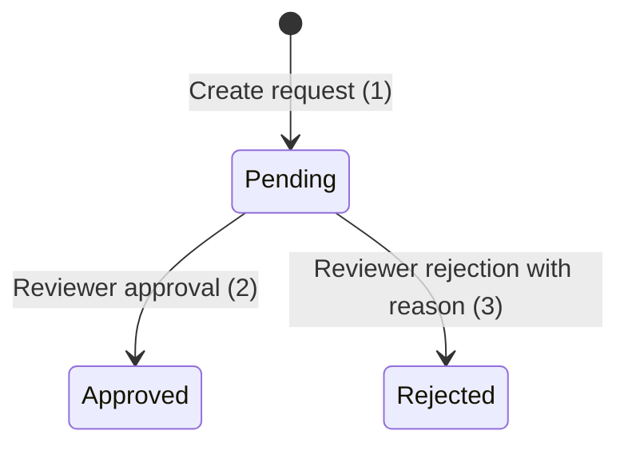
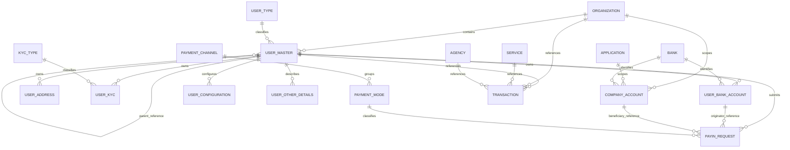

# FINOVA application process flow

Prepared: 5 October 2026. Scope: the application in this repository.

See [Data Flow Diagrams](DATA_FLOW_DIAGRAM.md) for context, frontend/backend data movement, logical stores and detailed workflow data flows.

## 1. Scope and evidence

This document describes the React frontend, the backend API contracts it calls, and the logical database responsibilities implied by those contracts.

**Verified** means behavior visible in the checked-in frontend source. **Inferred** means expected backend processing or logical persistence derived from API request/response fields. **Recommended** means a control to verify or implement, not an existing feature.

No backend controllers, database migrations, SQL scripts, ORM schema, or database connection configuration were found in this repository. The backend language/framework, database engine, physical table names, stored procedures, actual foreign keys, transaction boundaries, and file-storage provider are therefore unverified. All database objects and relationships below are conceptual. An API call does not establish that a specific SQL statement or provider payment occurs.

Current source takes precedence over README migration notes. In particular, password recovery now has API calls, the current wallet creation screen uses one multipart request, and dedicated report exports generate Excel-compatible XML `.xls` files.

## 2. Application purpose and participants

FINOVA is a financial operations dashboard with authentication, organization and user management, user addresses/KYC/bank details, company accounts, pay-in creation and review, transaction reporting, master data, pricing configuration, application permissions, and notification configuration.

| Participant | Responsibilities exposed by the application |
| --- | --- |
| Signed-in user | Access permitted screens, submit pay-ins, view own requests and available account information |
| Authorized reviewer | Search requests, inspect receipts, approve/reject selected requests |
| Authorized administrator | Manage organizations, users, reference data, applications, permissions, pricing, gateways and templates |
| Backend API | Authenticate requests, enforce permissions, perform domain processing and return results; implementation unavailable |
| Database/storage | Persist domain records and documents; implementation unavailable |

These are functional participants, not a confirmed mapping to every numeric `UserTypeId` or role.

## 3. Overall architecture



Solid edges represent frontend behavior. Dashed edges represent backend responsibilities whose implementation is absent.

| Layer | Implementation / responsibility | Evidence |
| --- | --- | --- |
| Startup | React 19, TypeScript, Vite; theme, error boundary, query and auth providers | `package.json`, `src/main.tsx` |
| Navigation | BrowserRouter, lazy page imports, protected dashboard and menu permissions | `src/app/App.tsx`, `src/app/Shell.tsx`, `src/app/route-components.ts` |
| UI | MUI, dedicated domain screens and shared form/table components | `src/pages`, `src/components` |
| Server-state cache | TanStack Query; default query stale time 30 seconds; no automatic retries or focus refetch by default | `src/main.tsx` |
| API adapter | Fetch, JSON/multipart encoding, token headers, response validation and errors | `src/core/api.ts` |
| Backend contracts | Domain-specific service wrappers and generated operation catalog | `src/services` |
| Persistence | Logical entities inferred from IDs, fields and list/create/update contracts | Service request types and models |

## 4. General request process



The frontend uses `VITE_API_BASE_URL` as the API origin/base path and `VITE_API_TOKEN` for the `APIToken` header. Authenticated calls add `UserToken`. Anonymous login/recovery calls still send `APIToken`. Multipart requests allow the browser to set the content type and boundary. Query parameters are encoded.

The client validates the common response envelope using Zod. It handles HTTP errors, malformed JSON, `HasError` values of `true`, `"true"`, `"True"` or `"1"`, and provider-style `status: false`. Domain payloads usually appear under `Result`; some screens apply additional schemas. HTTP 204 yields an empty result. Not every payload has a domain-specific schema.

## 5. Login, session and menu process



The session contains token, username, display name, user type and expiry in the browser's `sessionStorage` key `finova.auth`. It is saved only after both login and profile requests succeed. The profile lookup during login is explicitly anonymous in the current adapter; the backend must determine whether that exposure is appropriate.

`VITE_SESSION_MINUTES` defaults to 60 minutes, with valid configured values capped at 1,440 minutes. Session expiry, logout and authenticated HTTP 401 clear the session; auth state also clears query data. Logout is local and does not call a server revocation endpoint. No refresh-token endpoint is used.

Menu data drives frontend route permissions. A returned Notification Manager group can receive built-in submenu defaults when the backend provides no children. Menu checks are UI controls; backend authorization remains necessary for each action.

## 6. Password recovery and account controls

| Step | Frontend action | Backend contract | Logical persistence / processing (inferred) |
| --- | --- | --- | --- |
| Request recovery | Trim user code and submit | `POST /UserMgr/ForgotPassword`, anonymous | Find user; create/send a recovery OTP |
| Reset password | Submit user code, OTP, new password and confirmation | `POST /UserMgr/ResetPassword`, anonymous | Validate OTP and update credential |
| Administrator password change | Submit user ID and password settings | `POST /UserMgr/ChangeUserPassword` | Change credential and expiry setting |
| Lock / unlock account | Submit selected user and lock information | `/UserMgr/LockUserMaster`, `/UserMgr/UnlockUserMaster/{id}` | Update lock state |

OTP generation, expiry, delivery, rate limits, password hashing and token revocation cannot be established from the frontend. Their verification belongs to the backend review.

## 7. Organization and user management



The branches are related records saved through separate requests; this diagram does not imply one database transaction or an enforced ordering among all detail steps. The user master must first have a valid ID.

| Business operation | Main contracts | Logical database effect (inferred) |
| --- | --- | --- |
| Organization management | `/OrgMgr/CreateOrganization`, `/OrgMgr/UpdateOrganization`, `/OrgMgr/GetAllOrganizations` and detail/delete endpoints | Organization identity, contact, legal and status information |
| User master | `/UserMgr/CreateUserMaster`, `/UserMgr/UpdateUserMaster`, `/UserMgr/GetUserMasterByID` | User identity associated with organization and user type |
| Address | `/UserMgr/CreateUserAddress`, `/UserMgr/UpdateUserAddress`, `/UserMgr/GetUserAddressesByUserMasterID` | Address rows associated with user and demographic reference |
| KYC | `/UserMgr/CreateUserKyc`, `/UserMgr/UpdateUserKyc`, `/UserMgr/GetUserKycByUserMasterID` | Document type, document number, status, rejection information and file reference |
| Bank account | `/UserMgr/CreateUserBankAccount`, `/UserMgr/UpdateUserBankAccount`, `/UserMgr/GetUserBankAccountsByUserMasterID` | User's originator account and supporting document |
| Configuration | `/UserMgr/CreateUserConfiguration`, `/UserMgr/UpdateUserConfiguration` | Transaction limits, plan, charge type and pay-in limits |
| Other details | `/UserMgr/CreateOtherDetails`, `/UserMgr/UpdateOtherDetails` | PAN, Aadhaar and GST details |
| Parent relationship | `POST /UserMgr/MapUserParent`; `GET /UserMgr/GetUsersByParentId/{id}?userTypeId=...` | Parent-child user relationship |

Current KYC and bank-account wizard saves use multipart bodies when files are present. The KYC adapter maps the update ID to `UserKycMasterId`. KYC and bank-account create/update requests set `Status: 8`; its backend business meaning is unverified and must not be assumed to be the wallet pending status.

Legacy `/User/...` onboarding and document-approval contracts also exist, including `/User/ApproveRejectUserDocument`. A contract in a service catalog is not proof that the current user wizard executes it.

## 8. Company account management

Company accounts identify available receiving accounts for pay-in selection. The frontend loads organizations, applications and banks as needed, submits account information and an optional document, then refreshes the account list.

| Action | Contract |
| --- | --- |
| Create / update | `POST /Wallet/CreateCompanyAccount`, `POST /Wallet/UpdateCompanyAccount` using FormData |
| List / detail | `GET /Wallet/GetAllCompanyAccounts`, `GET /Wallet/GetCompanyAccountByID?companyAccountId=...` |
| Available accounts | `GET /Wallet/GetActiveCompanyAccounts` |
| Scope lookup | Organization/application-specific `/Wallet/GetCompanyAccountsBy...` methods |
| Delete | `DELETE /Wallet/DeleteCompanyAccount/{id}` |

Logical data includes company account ID, organization ID, application ID, bank ID, account name/number, IFSC, branch information, remarks, file and status. Physical deletion versus soft deletion is unverified.

## 9. Pay-in creation



The screen resolves the current user ID from `/User/GetUserMasterDetailsforConfig`. It loads active payment channels/modes, company accounts and the user's active bank accounts. Payment modes are filtered by the selected channel. Submission includes `UserMasterId`, `PaymentChanelID`, `PaymentModeId`, `Amount`, `Charge`, `Status`, optional account IDs, deposit date, references, remarks and `File`.

The current screen sends the receipt in the same multipart creation call. It does not execute a separate receipt upload. Legacy catalog operations `/Transaction/NewPayinRequest` and `/Transaction/UpdatePayinRecieptFile` remain separate contracts and must not be substituted for the current wallet process without checking the consuming screen.

A local submission lock prevents concurrent clicks while the request is pending. It does not guarantee backend idempotency. After an ambiguous network failure, the recommended recovery is to inspect the request list before creating another request.

## 10. Pay-in review, approval and rejection



The list uses `POST /Wallet/SearchPayinRequests`, dates from start-of-day through end-of-day and page size 20. Approval/rejection bodies are mapped by the adapter to:

```json
{ "RequestID": 123, "Action": "APPROVE", "RejectedReason": null }
```

```json
{ "RequestID": 123, "Action": "REJECT", "RejectedReason": "Reference could not be verified" }
```

Selected requests are processed sequentially. Some may succeed while others fail; the frontend reports both outcomes. This is not an atomic batch operation.



These status numbers are verified frontend wallet constants. Backend enforcement of permitted transitions and protection against simultaneous reviewers are unverified. Approval does not, by itself, prove a wallet balance credit, ledger entry or bank transfer; those side effects must be confirmed in backend code.

`/Dashboard/TransferRequestList` is a report screen using the same pay-in search API, with Approved as the initial filter. It does not initiate a new payment-provider transfer.

## 11. Transactions, reports and dashboard

| Feature | Current contract / behavior | Logical reads (inferred) |
| --- | --- | --- |
| Dashboard | `POST /Report/AdminDashboard` | Operational totals and user/date summaries |
| Transaction report | `POST /Report/TransactionDetailsReport` | Transactions joined with user, organization, service and agency data |
| User report | `POST /Report/GetUserMasterListReport` | Users, user types and parent relationships |
| User statement | Catalog contract `/Transaction/GetUSerStatement` | User financial statement records |
| Day book / summary | `/Transaction/GetDayBookByUserId`, `/Report/GetTransactionSummaryByUserId` | Financial aggregates |
| Transfer report | `/Wallet/SearchPayinRequests`, initially approved | Pay-in requests and receipt references |

The transaction report sends filters, page number/size and sort options. Its response schema expects `Result.Records` and `Result.Paging` with `TotalRecords`, `TotalPages` and `HasNextPage`. Other lists accept different result layouts; one global paging shape should not be assumed.

Dedicated pay-in/transfer exports fetch successive matching pages, detect repeated request IDs and generate an Excel-compatible XML `.xls` download. Other components may export only loaded rows or CSV; the screen's implementation defines export scope. Exports occur in the browser, not through a verified database export job.

`TransactionService.createNewTransaction` exposes `POST /Transaction/CreateNewTransaction` with organization/user/service/agency IDs, amount, fee, margin and partner references. No production caller was found in the current `src` tree beyond its definition. It is an available frontend contract, not an established end-to-end transaction initiation screen. Provider settlement, reversal, callbacks and reconciliation remain unverified.

## 12. Master data, pricing, access and notifications

| Domain | Frontend process | Logical data / backend responsibility (inferred) |
| --- | --- | --- |
| Master data | List/create/edit reference records and load active lookups through `MasterDataService` | Banks, states, districts, demographics, user/company types, KYC types, agencies, services, payment channels/modes, ledger and calculation types |
| Pricing/configuration | Load and maintain plans, transaction slabs, top-up charges, commission distribution and service policies through `ConfigService` and specialized pages | Fee/commission rules and transaction limits; actual financial calculation execution unverified |
| Application and access management | Manage applications, modules, menus, roles, tasks and permissions through `AppMgrService` / `SysMgrService` | Access catalog and mappings; authoritative permission evaluation belongs to backend |
| Notification administration | Create/list/view/update/delete SMS/email gateways and templates; maintain template/service types through `/Notification/...` | Gateway configuration, template content and classifications |

Notification administration is verified. Automatic message sending after pay-in approval, KYC decisions or transaction completion is not established. Recovery OTP delivery is inferred from its API purpose; the provider and delivery mechanism are unavailable.

## 13. Logical database model

**Conceptual only:** names in this diagram are readable business entities, not verified physical tables. Relationships represent ownership/reference fields exposed by API contracts; cardinality and constraints require database confirmation.



| Logical entity group | Contract fields / identifiers | Persistence interpretation |
| --- | --- | --- |
| Organization | `OrganizationID`, code, legal/contact data, status | Tenant/business identity |
| User master | `UserMasterID`, `OrganizationID`, `UserTypeId`, username, identity, lock/status data | User identity and access state |
| User details | `UserAddressID`, `UserKYCID`, `OriginatorAccountID`, `ConfigurationId`, `OtherDetailId`, user owner ID | Child records for onboarding and operations |
| Company account | `CompanyAccountId`, organization/application/bank IDs, account/branch information | Receiving account records |
| Pay-in request | `RequestID`, user/channel/mode/account IDs, amount, charge, dates, references, status, rejection reason | Pay-in lifecycle record |
| Transaction | Transaction IDs/codes, user/organization/service/agency IDs, partner/reference fields, amount/fee/margin/status | Financial transaction record used in reports |
| Document references | `FileUrl`, receipt URL variants, filename/media fields | Document metadata or location; file bytes could be stored separately |
| Access configuration | Application, menu, module, role, task, permission IDs and mappings | Access catalog |
| Financial configuration | Plan/slab/calculation/charge IDs, limits and distribution fields | Pricing and policy definitions |
| Notification configuration | Gateway/template/type/service IDs and associated fields | Notification settings |

The client uses inconsistent historical field spellings and casing, for example `BenficiaryAccountId`, `PaymentChanelID`, `Ifsccode` and `TxnPlateform`. Preserve the actual service contract when integrating. Similar names across old `/User` and new `/UserMgr` APIs do not prove identical physical records.

No verified wallet-balance or ledger-write schema is available. Statement and ledger-type contracts suggest financial accounting concepts, but they do not establish double-entry accounting or the timing of financial postings.

## 14. Backend and database processing to confirm

The following is a **recommended review checklist**, not verified implementation:

| Operation | Backend checks to confirm | Database/storage guarantees to confirm |
| --- | --- | --- |
| Authentication/recovery | Credential hashing, OTP lifetime, throttling, authorization and token lifecycle | Unique user identity and protected credential/recovery records |
| User onboarding | Organization scope, valid reference IDs, duplicate identity/account checks | Owner/reference integrity and recovery from partially saved detail steps |
| File submission | Content/type/size checks, authorization to read documents, storage ownership | Reliable record-to-file association and cleanup of abandoned files |
| Pay-in creation | Trusted user identity, account scope, configured limits, duplicate references | Decimal monetary precision and idempotent creation strategy |
| Approval/rejection | Reviewer authority, allowed current state and audit trail | Atomic decision update; prevention of duplicate financial posting if posting occurs |
| Transaction processing | Provider mapping, result handling, retries, reversals and reconciliation | Defined posting/settlement transaction boundaries and unique external references |
| Reports | Tenant/user scope, valid filters and allowed sort columns | Stable pagination and consistent export results |
| Deletion | Dependency handling, retention and authorization | Documented physical versus soft deletion behavior |

## 15. Error and recovery process

| Condition | Verified frontend behavior | Operational interpretation |
| --- | --- | --- |
| Missing/invalid API base | Raise configuration error | Configure build environment |
| Missing/expired session | Clear session and reject authenticated calls | Sign in again |
| Authenticated HTTP 401 | Clear session; protected routes depend on auth state | Renew authentication through login |
| HTTP 403 | Display permission error | Backend denied the operation |
| Network failure | Display connection error | Write outcome may be unknown; inspect saved records before resubmission |
| API `HasError` / `status: false` | Display backend error/message | Business/provider failure |
| Invalid JSON/envelope | Display unexpected response error | Contract or server response requires investigation |
| Multi-request decision failure | Report per-ID failures and successes; reload list | Some decisions may already be committed |
| Partial onboarding | Detail records saved independently | Reopen user and inspect existing records before retrying |

## 16. Runtime and deployment process

1. Configure the frontend's API base URL, API token and optional session duration for the build environment.
2. Run the repository's actual package commands: `npm run dev` for development and `npm run build` for production. The root package also provides `npm run typecheck`, `npm test` and `npm run test:e2e`.
3. Serve the generated `dist` application with SPA history fallback. `public/web.config` supplies IIS routing configuration.
4. Ensure the backend accepts the deployed frontend origin and the required authentication headers through CORS.
5. At runtime, the browser loads the static frontend and makes requests to the configured backend. Backend deployment, database migrations, backups and provider setup are separate processes absent from this repository.

`VITE_*` settings are browser-visible build configuration and cannot hold server-only secrets. Session storage and the query cache are frontend state; neither is the application database.

## 17. Source index and completion boundary

| Topic | Repository source |
| --- | --- |
| Startup and stack | [package.json](../package.json), [main.tsx](../src/main.tsx) |
| Routes and protection | [App.tsx](../src/app/App.tsx), [Shell.tsx](../src/app/Shell.tsx), [route-components.ts](../src/app/route-components.ts) |
| Menu handling | [navigation.ts](../src/core/navigation.ts) |
| HTTP/session/auth | [api.ts](../src/core/api.ts), [auth.tsx](../src/core/auth.tsx), [session.ts](../src/core/session.ts) |
| User workflow | [UserMasterComponent.tsx](../src/pages/Usermanager/UserMasterComponent.tsx), [userWizardData.ts](../src/pages/Usermanager/userWizardData.ts), [UserMgrservice.ts](../src/services/UserMgrservice.ts) |
| Password recovery | [passwordRecovery.ts](../src/services/passwordRecovery.ts) |
| Wallet and approvals | [WalletService.ts](../src/services/WalletService.ts), [CreatePayinRequestComponent.tsx](../src/pages/Wallet/CreatePayinRequestComponent.tsx), [PayinRequestListComponent.tsx](../src/pages/Wallet/PayinRequestListComponent.tsx), [payinRequests.ts](../src/pages/Wallet/payinRequests.ts) |
| Transfer report | [TransferRequestListComponent.tsx](../src/pages/Repost/TransferRequestListComponent.tsx) |
| Transaction/report contracts | [TransactionService.ts](../src/services/TransactionService.ts), [ReportService.ts](../src/services/ReportService.ts), [ReportmanService.ts](../src/services/ReportmanService.ts) |
| Organizations and notifications | [OrgMgrService.ts](../src/services/OrgMgrService.ts), [NotificationService.ts](../src/services/NotificationService.ts) |
| Generated/legacy operations | [operations.ts](../src/services/operations.ts), [catalog.ts](../src/services/catalog.ts) |
| Excel export | [exportToExcel.ts](../src/core/exportToExcel.ts) |

This is a source-based process document, not evidence of live backend execution. To turn the inferred backend/database portions into an implementation specification, inspect the backend repository, API specification and deployed database schema, then confirm authorization, status transitions, storage, financial postings, provider processing and transaction boundaries.
