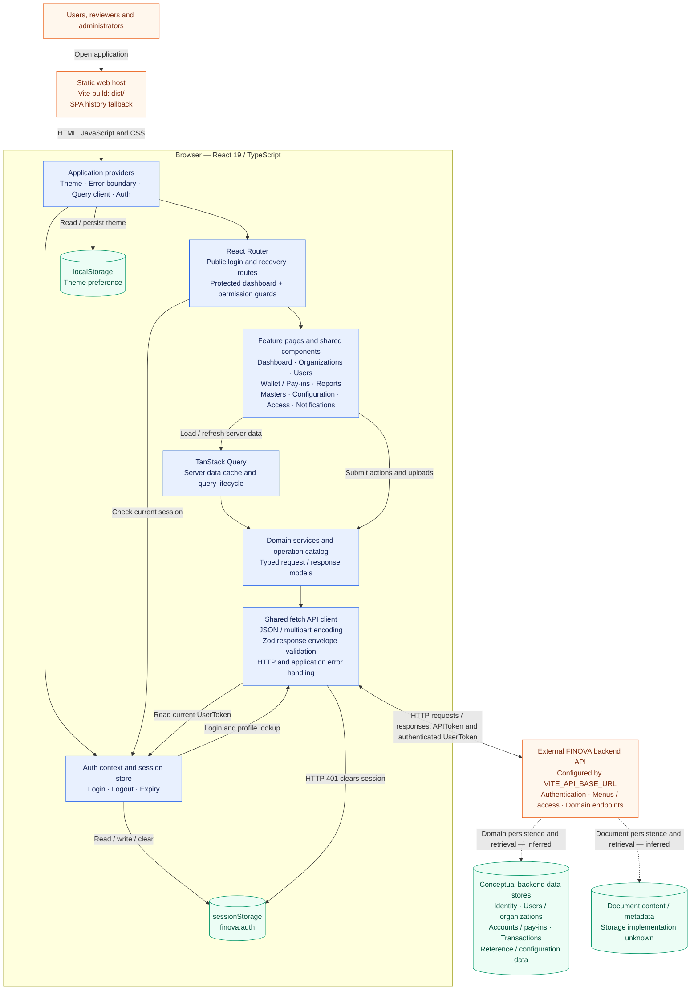
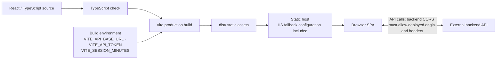

# FINOVA architecture

Based on the current frontend source. Solid arrows show implemented dependencies or request paths. Dashed arrows show inferred backend responsibilities; backend internals and storage technologies are not available in this repository.

## System architecture

## Frontend module map

| Layer             | Source            | Responsibility                                                           |
| ----------------- | ----------------- | ------------------------------------------------------------------------ |
| Bootstrap         | `src/main.tsx`    | Mount React and initialize application providers                         |
| Routing and shell | `src/app/`        | Lazy route modules, dashboard layout, session and menu permission guards |
| Feature UI        | `src/pages/`      | Domain workflows and page-specific validation                            |
| Shared UI         | `src/components/` | Forms, tables, result views, file viewers and status handling            |
| Core              | `src/core/`       | API transport, authentication, sessions, navigation and permissions      |
| Services          | `src/services/`   | Domain API wrappers and schema-driven operation catalog                  |
| Contracts         | `src/models/`     | Request and response types                                               |
| Appearance        | `src/theme/`      | MUI theme, CSS tokens and persisted theme selection                      |

The diagram groups request and response paths for readability. TanStack Query manages server data; form and component state also live in React and React Hook Form. Menu-based frontend guards control navigation, while authorization must be enforced by the backend. Logout, session expiry and authenticated HTTP 401 clear the local session; the auth provider clears the query cache when the session is absent. There is no implemented refresh-token flow.

`src/services/device.ts` additionally defines a direct browser adapter for a local Morpho RD service at `https://localhost:11100`. This is separate from the FINOVA API client; the adapter's presence does not establish an active page integration or verified hardware workflow. SMS/email delivery, payment-provider processing, ledger posting and backend deployment topology are not established by this frontend.

## Build and deployment

Build environment values are bundled into the browser application. The deployment host and backend infrastructure are not specified by this repository.

Sources: [bootstrap](../src/main.tsx), [routing](../src/app/App.tsx), [shell](../src/app/Shell.tsx), [API client](../src/core/api.ts), [authentication](../src/core/auth.tsx), [session store](../src/core/session.ts), [theme persistence](../src/theme/theme.utils.ts), [build configuration](../vite.config.ts), and [IIS configuration](../public/web.config).

Related diagrams: [Data flow](DATA_FLOW_DIAGRAM.md) and [Application process flow](APPLICATION_PROCESS_FLOW.md).
