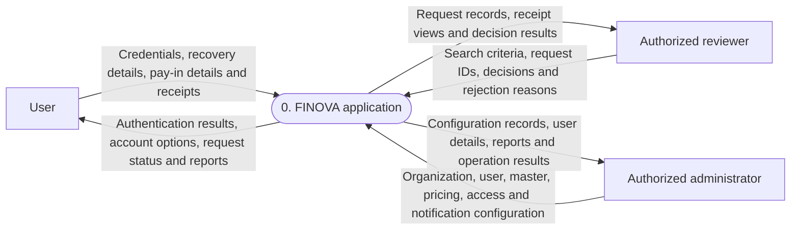
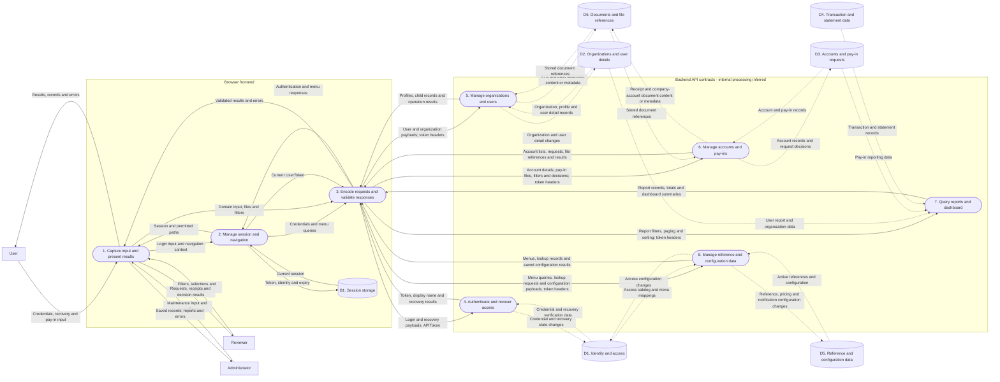
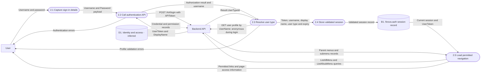
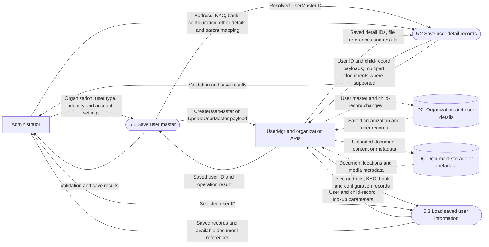
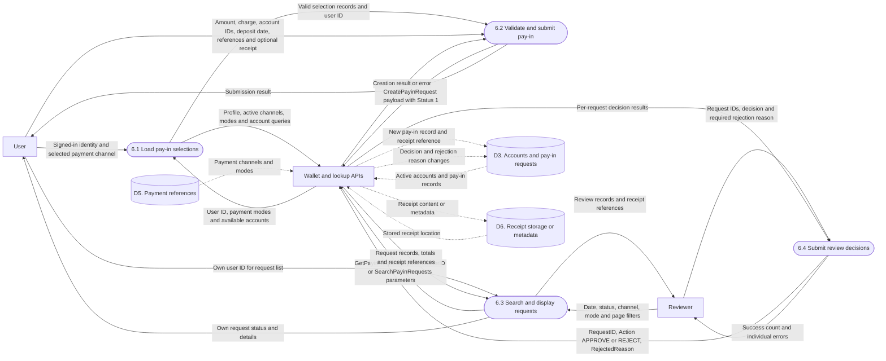
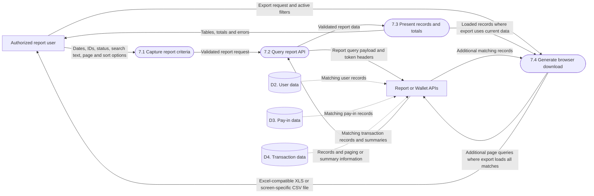

# FINOVA data flow diagrams

Prepared: 5 October 2026. Companion to [Application Process Flow](APPLICATION_PROCESS_FLOW.md).

These diagrams show **data movement**, rather than execution order. Frontend-to-API flows are verified from this repository. Backend-to-database flows are inferred because backend code and physical database schemas are unavailable. Store names are conceptual, not confirmed table names.

Notation: rectangles represent external participants; rounded nodes represent processes; cylinders represent data stores. Solid arrows show verified flows; dashed arrows show inferred flows. Every arrow is labeled with the data it carries. Browser session storage is separate from the backend database.

## Level 0: system context

The entire frontend and backend are represented as one FINOVA process. Internal stores are omitted at this level.

Actual SMS/email delivery and financial-provider exchanges are not established by the current frontend source, so they are not represented as verified external flows.

## Level 1: frontend, backend and data stores

Process 7 groups reporting responsibilities for readability. Pay-in reports actually use `/Wallet/SearchPayinRequests`; transaction and user reports use `/Report/...` contracts. Transaction writes and provider settlement are outside the verified active workflows; D4's originating write process is therefore not asserted here.

## Level 2: authentication and permissions

The session is saved after both login and profile lookup succeed. Expiry, logout or authenticated HTTP 401 clear local session state. No server logout or refresh-token flow is used. Recovery data flows through anonymous `POST /UserMgr/ForgotPassword` and `POST /UserMgr/ResetPassword`; OTP delivery and storage are unverified.

## Level 2: user onboarding and document data

Each child record references the resolved user ID. Separate requests can leave partially saved onboarding data; the frontend does not establish an atomic onboarding transaction. KYC and bank documents in the current wizard use their respective multipart create/update contracts.

## Level 2: pay-in creation and review

The active creation screen sends the optional receipt within `/Wallet/CreatePayinRequest`, not through a second upload. Review sends one `/Wallet/ApproveRejectPayinRequest` call per selected ID. Frontend wallet statuses are Pending 1, Approved 2 and Rejected 3. A balance credit, ledger posting or provider transfer is not established by the approval contract.

## Level 2: reports and export

Transaction/user reports use `/Report/TransactionDetailsReport` and `/Report/GetUserMasterListReport`. Dashboard summaries use `/Report/AdminDashboard`. The Transfer Report reads pay-in records and initially filters Approved. Export scope and format vary by screen; dedicated pay-in/transfer exports fetch successive pages and create XML `.xls` files locally.

## Data store dictionary

| Store | Logical contents | Evidence / limitation |
| --- | --- | --- |
| B1 | Token, username, display name, user type, expiry | Verified browser `sessionStorage`; not a backend database |
| D1 | Credential/recovery data, roles, menus, access mappings | Inferred from authentication and access contracts |
| D2 | Organizations, users, addresses, KYC metadata, bank details, user limits and parent mappings | Inferred from OrgMgr/UserMgr requests |
| D3 | Company accounts, pay-in records, statuses, reasons and receipt references | Inferred from Wallet requests |
| D4 | Transactions, financial statement records and aggregates | Inferred from report contracts; writes and accounting design unverified |
| D5 | Master references, plans, pricing, policies, gateways and templates | Inferred from configuration contracts |
| D6 | Uploaded files or their metadata and locations | Storage technology and placement of file bytes unverified |

## Contract references

The diagrams are grounded in [API client](../src/core/api.ts), [authentication](../src/core/auth.tsx), [session storage](../src/core/session.ts), [navigation](../src/core/navigation.ts), [user services](../src/services/UserMgrservice.ts), [wallet services](../src/services/WalletService.ts), [report services](../src/services/ReportService.ts), and the source index in [Application Process Flow](APPLICATION_PROCESS_FLOW.md#17-source-index-and-completion-boundary).
